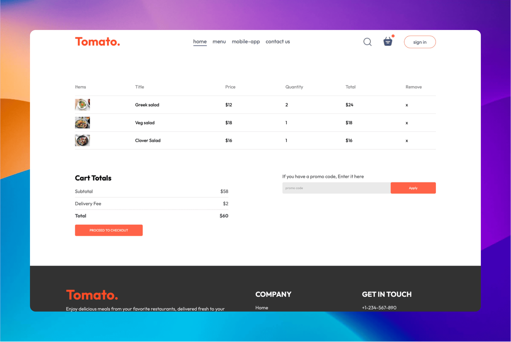

# Tomato : Food Delivery App - MERN Stack - Project Timeline

This project is a food delivery application built using the MERN stack (MongoDB, Express.js, React.js, Node.js). 

## 📷 Screenshots
### Home-Page

### Menu-Page

### Order-Page


## ✨ Features  

### **User Panel**  
- Browse and search for food items dynamically fetched from the database  
- Add items to the cart and place orders  
- User authentication and profile management  
- Real-time order tracking  

### **Admin Panel**  
- Manage food items (add, update, delete)  
- Track and manage customer orders  
- View analytics on sales and customer behavior  

## 🛠️ Tech Stack  

- **Frontend**: React - JSX, Redux, Vanilla CSS
- **Backend**: Node.js, Express.js  
- **Database**: MongoDB (with Mongoose ORM)  
- **Authentication**: JWT-based authentication  
- **Deployment**: Docker / Vercel / Heroku (optional)  

## 🚀 Installation & Setup  

### **1. Clone the repository**  
```bash
git clone https://github.com/403errors/food-delivery.git  
cd food-delivery-app
```  

### **2. Install dependencies**  
```bash
npm install  
```  

### **3. Configure Environment Variables (.env Setup)**  

Create a `.env` file in the root directory and add the following:  

```ini
PORT=5000
MONGO_URI=your_mongodb_connection_string
JWT_SECRET=your_jwt_secret
CLIENT_URL=http://localhost:3000
STRIPE_SECRET_KEY=your_stripe_secret_key 
```
> ⚠️ Make sure to replace placeholder values with actual credentials.  

### **4. Start the development server**  

For the backend:  
```bash
npm run server  
```  
For the frontend:  
```bash
cd client  
npm start  
```  

## 🕑 Project Timeline

How project was completed in phases?! Look here for [Project Timeline](ProjectTimeline).


## 📌 Future Enhancements  
- Deployment on Vercel 
- AI-based recommendations for food items  
- Push notifications for real-time order updates  